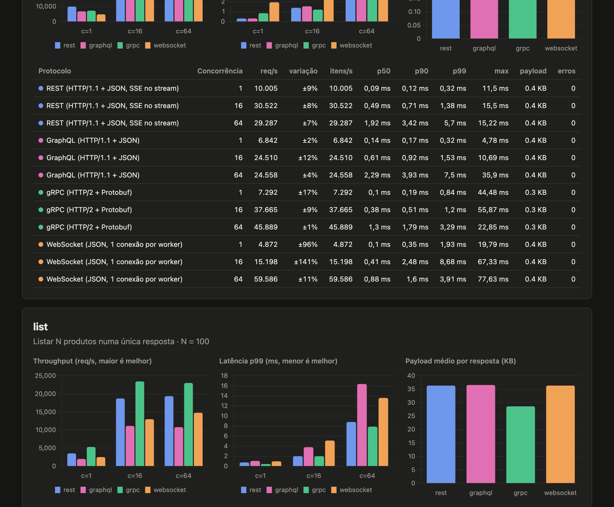

# Protocol Benchmark

A mesma API de catálogo de produtos implementada em **REST**, **GraphQL**, **gRPC**, **WebSocket** e **SSE**, mais um gerador de carga que mede throughput, latência (p50/p90/p99) e tamanho de payload de cada protocolo sob os mesmos cenários.



## O que é comparado

| Protocolo | Transporte | Serialização | Conexões do cliente | Implementação no servidor |
|---|---|---|---|---|
| REST | HTTP/1.1 | JSON (Jackson) | Pool do `java.net.http.HttpClient` | Spring MVC em virtual threads |
| GraphQL | HTTP/1.1 (`POST /graphql`) | JSON | Pool do `HttpClient` | Spring for GraphQL |
| gRPC | HTTP/2 | Protobuf | 1 canal multiplexado, stub assíncrono no stream | grpc-java (Netty) |
| WebSocket | TCP após upgrade HTTP | JSON em frames de texto | 1 conexão por worker | Spring WebSocket (Tomcat) |
| SSE | HTTP/1.1 chunked | JSON por evento | Pool do `HttpClient` | Spring MVC `StreamingResponseBody` |

Três cenários, todos com os mesmos dados (um catálogo determinístico de 10.000 produtos com ~380 bytes cada em JSON):

| Cenário | O que faz | REST | GraphQL | gRPC | WebSocket |
|---|---|---|---|---|---|
| `single` | Busca 1 produto por id aleatório | `GET /api/products/{id}` | `query { product(id) }` | unary `GetProduct` | mensagem `get` |
| `list` | Retorna N produtos numa única resposta | `GET /api/products?limit=N` | `query { products(limit) }` | unary `ListProducts` | mensagem `list` |
| `stream` | Envia N produtos como mensagens separadas | SSE `GET /api/products/stream` | não suportado* | server streaming `StreamProducts` | N mensagens + `done` |

\* Streaming em GraphQL exige subscriptions sobre WebSocket (`graphql-ws`), que é outro protocolo por baixo. Ficou fora para não misturar as coisas.

## Como rodar

Requisitos: JDK 21+.

```bash
./run-benchmark.sh
```

O script compila o projeto se necessário, sobe o servidor numa JVM separada, roda o benchmark completo e grava em `results/`:

- `report.html`: gráficos de throughput, latência p99 e payload por cenário
- `results.md`: tabelas em Markdown
- `results.json`: dados brutos

Todas as opções do gerador de carga:

```bash
./run-benchmark.sh --help

./run-benchmark.sh --protocols=grpc,rest --scenarios=list --concurrency=1,8,32,128 --duration=20s
```

| Opção | Padrão | Descrição |
|---|---|---|
| `--protocols` | `rest,graphql,grpc,websocket` | Protocolos a testar |
| `--scenarios` | `single,list,stream` | Cenários |
| `--concurrency` | `1,16,64` | Número de workers simultâneos (cada valor é uma rodada) |
| `--warmup` | `5s` | Aquecimento da JIT antes de medir |
| `--duration` | `5s` | Duração de cada medição |
| `--repeat` | `3` | Medições por combinação; o relatório usa a mediana |
| `--list-size` | `100` | Itens no cenário `list` |
| `--stream-size` | `1000` | Itens no cenário `stream` |
| `--host`, `--http-port`, `--grpc-port` | `localhost`, `8080`, `9090` | Onde está o servidor |

Para rodar servidor e cliente em máquinas diferentes (o que dá números mais realistas):

```bash
java -jar server/target/server-1.0.0-exec.jar                       # máquina A
java -jar bench/target/bench.jar --host=maquina-a --duration=30s    # máquina B
```

Os testes sobem o servidor em portas aleatórias e verificam que todos os protocolos devolvem exatamente os mesmos dados:

```bash
./mvnw verify
```

## Resultados

Rodada completa com as opções padrão (concorrência 1/16/64, warmup de 5 s, mediana de 3 medições de 5 s), cliente e servidor no mesmo MacBook (Apple Silicon, 10 CPUs, JDK 25). Relatório interativo em [`results/report.html`](results/report.html) e dados brutos em [`results/results.json`](results/results.json).

> A máquina não estava ociosa (load average 45 no início, com navegador e uma VM abertos). A coluna **variação** mostra a dispersão entre as 3 medições: quase tudo ficou abaixo de ±10%, mas WebSocket `single` com c=1 e c=16 oscilou muito (±96% e ±141%). Em rodadas anteriores, com a máquina menos carregada, esses dois casos deram ~17k e ~63k req/s. Para números de referência, rode em máquinas dedicadas.

### O que os números mostram

**Payload.** Protobuf é ~22% menor que JSON nos mesmos dados (295 B contra 377 B por produto; 28,6 KB contra 36,4 KB por lista de 100). O ganho vem de não repetir o nome dos campos e de codificar números em binário. O GraphQL é ligeiramente maior que o REST por causa do envelope `{"data": {...}}`.

**`single`: overhead por requisição.** Com o payload pequeno, o que pesa é o custo fixo de cada chamada. O WebSocket, com a conexão já aberta, só troca um frame em cada direção, sem parsear linha de requisição e headers HTTP, e chega a ~60k req/s com c=64. O gRPC vem em seguida (46k), à frente do REST (29k) e do GraphQL (25k), porque multiplexa tudo numa conexão HTTP/2 com headers comprimidos (HPACK).

**`list`: custo de serialização.** Com 36 KB por resposta, serializar e desserializar domina. Com c=1, o gRPC faz 1,5x mais requisições que o REST, com metade da latência p99 (0,44 ms contra 0,76 ms). Com c=64 a diferença cai (23k contra 19k req/s), porque os dois ficam limitados pela CPU compartilhada entre cliente e servidor. O **GraphQL fica em 55–60% do throughput do REST**: a engine resolve cada campo de cada objeto individualmente (100 produtos × 8 campos = 800 resoluções por resposta). É o preço da flexibilidade de escolher campos.

**`stream`: mensagens pequenas em sequência.** O gRPC entrega ~900 mil itens por segundo com um único cliente, 4,4x o SSE e 5,8x o WebSocket. O HTTP/2 do gRPC agrupa várias mensagens por escrita no socket. O SSE (`flush` a cada evento) e o WebSocket (um frame por mensagem) pagam uma chamada de sistema por item e mais o parse de JSON.

### A implementação importa tanto quanto o protocolo

A primeira versão do cliente gRPC usava o blocking stub padrão e ficou em último lugar no stream. Ajustes no cliente mudaram completamente o resultado:

| Cliente gRPC (cenário `stream`, N = 1000) | c=1 | c=16 | c=64 |
|---|---:|---:|---:|
| Blocking stub (iterator) | 66 | 159 | 152 |
| Stub assíncrono (`StreamObserver`) | 93 | 218 | – |
| Stub assíncrono + `directExecutor()` no canal | **896** | **1.162** | **1.124** |

O blocking stub pede uma mensagem por vez e cada uma passa por duas trocas de thread (event loop do Netty → executor → thread que itera). Com `directExecutor()` os callbacks rodam direto no event loop, o que é seguro quando eles não bloqueiam, como aqui. O ganho foi de 10x sem mudar nada no protocolo.

O mesmo ajuste no **servidor** é uma troca, não um ganho geral. Por isso ficou de fora:

| Servidor gRPC com `directExecutor()` | Padrão | Direct |
|---|---:|---:|
| `single`, c=64 (req/s) | 46.536 | **103.659** |
| `list`, c=64 (req/s) | **24.224** | 20.609 |
| `stream`, c=1 (streams/s) | **901** | 582 |

Chamadas curtas ficam 2x mais rápidas, mas o loop que envia 1000 mensagens passa a ocupar o event loop e atrasa todo o resto.

### Quando usar cada um

- **REST**: padrão para APIs públicas. Funciona em qualquer cliente, é fácil de cachear e depurar, e o desempenho é bom o bastante na maioria dos casos.
- **GraphQL**: quando clientes diferentes precisam de formatos diferentes dos mesmos dados (web, mobile, BFF). Troca CPU no servidor por menos requisições e menos over-fetching.
- **gRPC**: comunicação entre serviços, payloads grandes e streaming. Contrato tipado e payload menor, mas exige HTTP/2 e não roda direto no browser (precisa de gRPC-Web).
- **WebSocket**: comunicação bidirecional e de baixa latência sobre uma conexão persistente (chat, jogos, colaboração, dashboards ao vivo). O protocolo de mensagens, a correlação de requisições e a reconexão ficam por sua conta.
- **SSE**: notificações do servidor para o browser. É HTTP comum, reconecta sozinho e atravessa proxies, mas é unidirecional e só trafega texto.

### Tabelas completas

Cada linha é a mediana de 3 medições. Variação = (maior − menor throughput) / mediana.

### single — Buscar 1 produto por id (N = 1)

| Protocolo | Concorrência | req/s | variação | itens/s | p50 (ms) | p90 (ms) | p99 (ms) | max (ms) | payload | erros |
|---|---:|---:|---:|---:|---:|---:|---:|---:|---:|---:|
| rest | 1 | 10,005 | ±9% | 10,005 | 0.09 | 0.12 | 0.32 | 11.50 | 377 B | 0 |
| rest | 16 | 30,522 | ±8% | 30,522 | 0.49 | 0.71 | 1.38 | 15.50 | 377 B | 0 |
| rest | 64 | 29,287 | ±7% | 29,287 | 1.92 | 3.42 | 5.70 | 15.22 | 377 B | 0 |
| graphql | 1 | 6,842 | ±2% | 6,842 | 0.14 | 0.17 | 0.32 | 4.78 | 400 B | 0 |
| graphql | 16 | 24,510 | ±12% | 24,510 | 0.61 | 0.92 | 1.53 | 10.69 | 400 B | 0 |
| graphql | 64 | 24,558 | ±4% | 24,558 | 2.29 | 3.93 | 7.50 | 35.90 | 400 B | 0 |
| grpc | 1 | 7,292 | ±17% | 7,292 | 0.10 | 0.19 | 0.84 | 44.48 | 295 B | 0 |
| grpc | 16 | 37,665 | ±9% | 37,665 | 0.38 | 0.51 | 1.20 | 55.87 | 295 B | 0 |
| grpc | 64 | 45,889 | ±1% | 45,889 | 1.30 | 1.79 | 3.29 | 22.85 | 295 B | 0 |
| websocket | 1 | 4,872 | ±96% | 4,872 | 0.10 | 0.35 | 1.93 | 19.79 | 377 B | 0 |
| websocket | 16 | 15,198 | ±141% | 15,198 | 0.41 | 2.48 | 8.68 | 67.33 | 377 B | 0 |
| websocket | 64 | 59,586 | ±11% | 59,586 | 0.88 | 1.60 | 3.91 | 77.63 | 377 B | 0 |

### list — Listar N produtos numa única resposta (N = 100)

| Protocolo | Concorrência | req/s | variação | itens/s | p50 (ms) | p90 (ms) | p99 (ms) | max (ms) | payload | erros |
|---|---:|---:|---:|---:|---:|---:|---:|---:|---:|---:|
| rest | 1 | 3,566 | ±5% | 356,558 | 0.26 | 0.32 | 0.76 | 6.21 | 36.4 KB | 0 |
| rest | 16 | 18,747 | ±4% | 1,874,654 | 0.78 | 1.22 | 2.00 | 15.90 | 36.4 KB | 0 |
| rest | 64 | 19,377 | ±1% | 1,937,724 | 2.83 | 5.32 | 8.82 | 25.82 | 36.4 KB | 0 |
| graphql | 1 | 1,999 | ±1% | 199,884 | 0.48 | 0.54 | 1.06 | 4.24 | 36.6 KB | 0 |
| graphql | 16 | 11,158 | ±9% | 1,115,820 | 1.30 | 2.04 | 3.80 | 47.74 | 36.6 KB | 0 |
| graphql | 64 | 10,809 | ±4% | 1,080,904 | 5.32 | 9.07 | 16.37 | 51.42 | 36.6 KB | 0 |
| grpc | 1 | 5,328 | ±0% | 532,811 | 0.17 | 0.22 | 0.44 | 5.10 | 28.6 KB | 0 |
| grpc | 16 | 23,460 | ±3% | 2,345,969 | 0.61 | 0.92 | 1.99 | 12.24 | 28.6 KB | 0 |
| grpc | 64 | 23,014 | ±10% | 2,301,358 | 2.50 | 3.73 | 7.87 | 62.46 | 28.6 KB | 0 |
| websocket | 1 | 2,527 | ±9% | 252,733 | 0.36 | 0.44 | 0.98 | 21.01 | 36.4 KB | 0 |
| websocket | 16 | 13,003 | ±10% | 1,300,252 | 1.01 | 1.84 | 5.11 | 46.56 | 36.4 KB | 0 |
| websocket | 64 | 14,786 | ±2% | 1,478,603 | 3.83 | 6.58 | 13.60 | 130.37 | 36.4 KB | 0 |

### stream — Receber N produtos como stream de mensagens (N = 1000)

| Protocolo | Concorrência | req/s | variação | itens/s | p50 (ms) | p90 (ms) | p99 (ms) | max (ms) | payload | erros |
|---|---:|---:|---:|---:|---:|---:|---:|---:|---:|---:|
| rest | 1 | 202 | ±1% | 201,739 | 4.82 | 5.11 | 8.39 | 34.98 | 373.2 KB | 0 |
| rest | 16 | 545 | ±6% | 545,251 | 26.46 | 43.78 | 77.70 | 176.00 | 373.2 KB | 0 |
| rest | 64 | 625 | ±2% | 624,576 | 93.82 | 165.38 | 240.00 | 318.72 | 373.2 KB | 0 |
| grpc | 1 | 896 | ±6% | 896,282 | 1.08 | 1.20 | 1.82 | 5.32 | 285.9 KB | 0 |
| grpc | 16 | 1,162 | ±1% | 1,161,694 | 13.62 | 16.10 | 20.34 | 31.84 | 285.9 KB | 0 |
| grpc | 64 | 1,124 | ±3% | 1,123,544 | 55.30 | 62.75 | 82.94 | 139.52 | 285.9 KB | 0 |
| websocket | 1 | 154 | ±1% | 154,093 | 6.36 | 6.66 | 10.42 | 15.16 | 365.4 KB | 0 |
| websocket | 16 | 534 | ±9% | 534,170 | 27.52 | 44.67 | 78.34 | 123.52 | 365.4 KB | 0 |
| websocket | 64 | 515 | ±6% | 515,402 | 108.42 | 144.77 | 227.58 | 5066.75 | 365.4 KB | 0 |

## Como a medição funciona

- **Carga em loop fechado.** Cada worker é uma virtual thread que envia uma requisição, espera a resposta completa, registra a latência e envia a próxima. Com `c` workers há sempre no máximo `c` requisições em andamento. Isso mede a capacidade do sistema, não o comportamento sob uma taxa de chegada fixa.
- **A latência inclui a desserialização no cliente.** O JSON é convertido em `Product` e o Protobuf em objetos gerados, porque um cliente real sempre paga esse custo.
- **Toda resposta é validada.** Se vier com um número de itens diferente do esperado, conta como erro e não entra nas estatísticas.
- **HdrHistogram** registra as latências em microssegundos com 3 dígitos de precisão, sem perder a cauda como uma média faria.
- **O payload** é o corpo da resposta: bytes do JSON ou tamanho serializado do Protobuf. Headers HTTP, frames HTTP/2 e frames WebSocket não entram.
- **Aquecimento** de 5 s antes das medições, para a JIT compilar os caminhos quentes dos dois lados.
- **Repetição.** Cada combinação é medida 3 vezes e o relatório usa a mediana do throughput, junto com a dispersão entre as medições. Uma medição isolada num laptop pode variar bastante.

## Limitações

Benchmark de protocolo é fácil de interpretar errado. Os números aqui comparam **estas implementações Java, nesta máquina, com estes cenários**:

- Cliente e servidor rodam na mesma máquina por padrão e disputam CPU. Em loopback não há latência de rede, o que favorece protocolos verbosos: numa rede real, os bytes a mais do JSON pesariam mais.
- REST e GraphQL usam HTTP/1.1 sem TLS. Com HTTP/2 e TLS o cenário muda, principalmente em alta concorrência.
- O gRPC usa um único canal (uma conexão TCP) para todos os workers, que é o padrão recomendado. Em concorrência muito alta, vários canais podem render mais.
- WebSocket está no melhor caso possível: conexão já aberta e um worker por conexão, sem o custo do upgrade inicial nem correlação de mensagens concorrentes.
- Não há compressão (gzip) em nenhum protocolo.

## Estrutura

```
protocol-benchmark
├── api/      Product, catálogo determinístico e contrato .proto (gera o código gRPC)
├── server/   Spring Boot: REST, SSE, GraphQL, WebSocket (porta 8080) e gRPC (porta 9090)
└── bench/    gerador de carga: um cliente por protocolo, runner com HdrHistogram e relatórios
```

Para adicionar um protocolo basta implementar `ProtocolClient` no módulo `bench`, o endpoint correspondente no `server` e registrar o cliente em `Clients`. O teste de integração passa a cobri-lo automaticamente.

## Licença

[MIT](LICENSE)
